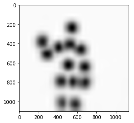
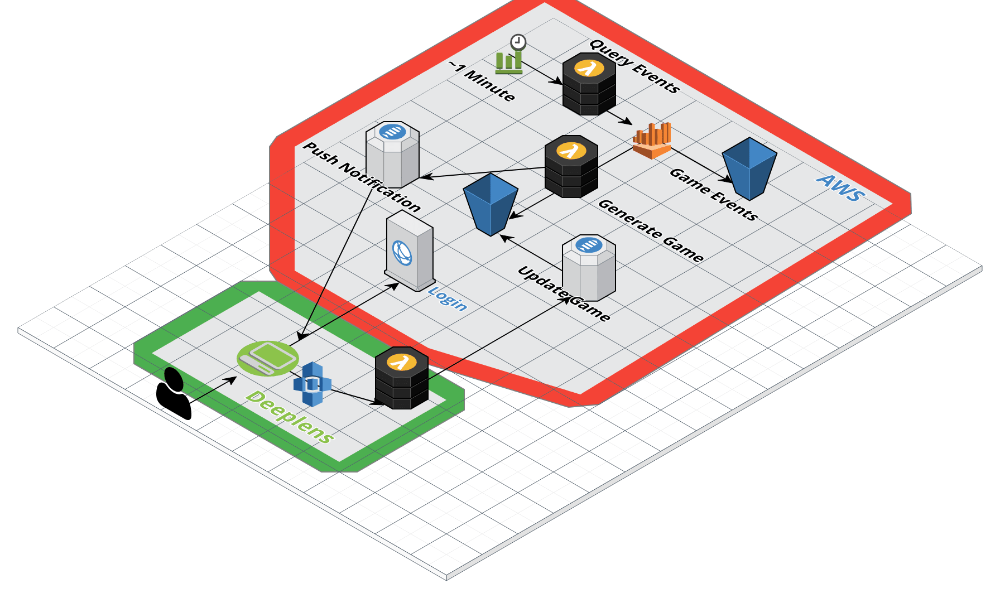

# Deeplens Simon-Says
This project is an entry into #AWSDeepLensChallenge.

</img>

## Overview
Simon Says is a childhood game where the players act out the commands from `Simon`. When `Simon says` to do something you do the action,
however when Simon doesn't give the command you should not do the action. Our project is building a Simon Says Deep Learning platform where
everyone can join the same global game using Deeplens to verify the correct action of each player.

<b>Fun Fact:</b> The guinness world record for a game of Simon Says is 12,215 people set on June 14, 2007 at the Utah Summer Games.

## Demo Video
[](https://youtu.be/SZTo7CqOjvU)

## Application

### Define Goals
- Have the device issue a `simon says` command.
- Monitor the camera stream and classify the player's action.
- Overlay a display of the player's pose and current action.
- Link the device to a global simon game network.  


### Deeplens
The Deeplens device is used to process the video stream of the player.  The video stream is formatted to fit our network of 184x184 resolution.  We crop
the left and right siding of the image to form a box and scale the image down keeping the aspect ratio.  Our model is optimized to use the GPU which is required
or processing time for one frame takes `~30-60s`, compared to about `.6-1s` using GPU.  We use the output, a series of images, to calculate the position of the body, which we
refer to as the pose map. The pose map consists of ordered (x,y) positions of each body part, which we feed into a classification network to tell us the predicted action.

* How we converted the realtimePose Model to run on Deeplens. [Convert Model](https://gistlog.co/MDBox/02a45550fe9fee761870ec667a41279d)

* Read More about how we classified the different poses in this [notebook](https://github.com/MDBox/deeplens-simon-says/blob/master/development/classify.ipynb).

#### Model Download Links
- Intel Optimized Realtime Pose - [realtimePose-Intel.zip](https://s3.amazonaws.com/mdbox-deeplen-simon/models/realtimepose-intel/realtimePose-Intel.zip)
- MXnet Pose Classification Model: [poseclassification.zip](https://s3.amazonaws.com/mdbox-deeplen-simon/models/pose-classifyer/poseclassification.zip)

### AWS Backend
The `Simon Says` game network is built using AWS services.  The process starts from `cloudwatch` where a chain of events is triggered every minute that will generate
and distribute a new game.  The first step is a `lambda` event that queries an S3 bucket using `Athena`, this query is used so we can add new game actions by just uploaded a file to S3.
After the `Athena` query is finished the output activates a 2nd `lambda` which is used to generate the next game by randomly picking one action and deciding if `simon` says or not and it
will publish the game to an `IoT` channel.  All Deeplens devices will register to this `IoT` channel and it will be notified when a new game starts.    

</img>
<small>Image Generated using [https://cloudcraft.co/]()</small>

* Read more about backend development [here](https://github.com/MDBox/deeplens-simon-says/tree/master/aws)


## Running The Demo
- Before running one minor change will need to be addressed and that is audio output.  In our case we were not able to hear audio until we
added the `aws_cam` user and GreenGrass user to the `audio` group.  If you do not hear sound please verify these group settings.
`sudo adduser ggc_user audio`
* We were not able to get audio playing using the deeplens deployment.

### Deploy from GreenGrass Service
1) Upload the model files to your S3 bucket for Deeplens.  
2) Create a new Lambda function using this packaged zip file [simon_posetest.zip](https://s3.amazonaws.com/mdbox-deeplen-simon/simon_posetest.zip). <b>Make sure to set the lambda handler to `greengrassSimonSays.function_handler`</b>  
3) Create a new Deeplens Project with the [model](https://s3.amazonaws.com/mdbox-deeplen-simon/models/realtimepose-intel/realtimePose-Intel.zip) and [lambda](https://s3.amazonaws.com/mdbox-deeplen-simon/simon_posetest.zip) function.  
4) Deploy to Deeplens.  

### Run Directly from Device
To get setup on the device all you need to do is `SSH` or open a `Terminal`, clone this repo, download the
optimized model and mxnet classification model, and install the python requirements.  

- It is best to stop GreenGrass Service before you do this.  `sudo systemctl stop greengrassd.service`.  

```bash
git clone https://github.com/MDBox/deeplens-simon-says
cd ./deeplens-simon-says/deeplens/simonsays
wget https://s3.amazonaws.com/mdbox-deeplen-simon/models/models.zip
unzip models.zip
sudo pip install -r requirments.txt
sudo python simon.py
```

## Citations
This project uses two open source projects as reference. The original model and development is credited to them.  
- [Openpose](https://github.com/CMU-Perceptual-Computing-Lab/openpose) -- [License](https://raw.githubusercontent.com/CMU-Perceptual-Computing-Lab/openpose/master/LICENSE)
- [mxnet_Realtime_Multi-Person_Pose_Estimation](https://github.com/dragonfly90/mxnet_Realtime_Multi-Person_Pose_Estimation) -- [License](https://raw.githubusercontent.com/CMU-Perceptual-Computing-Lab/openpose/master/LICENSE)
